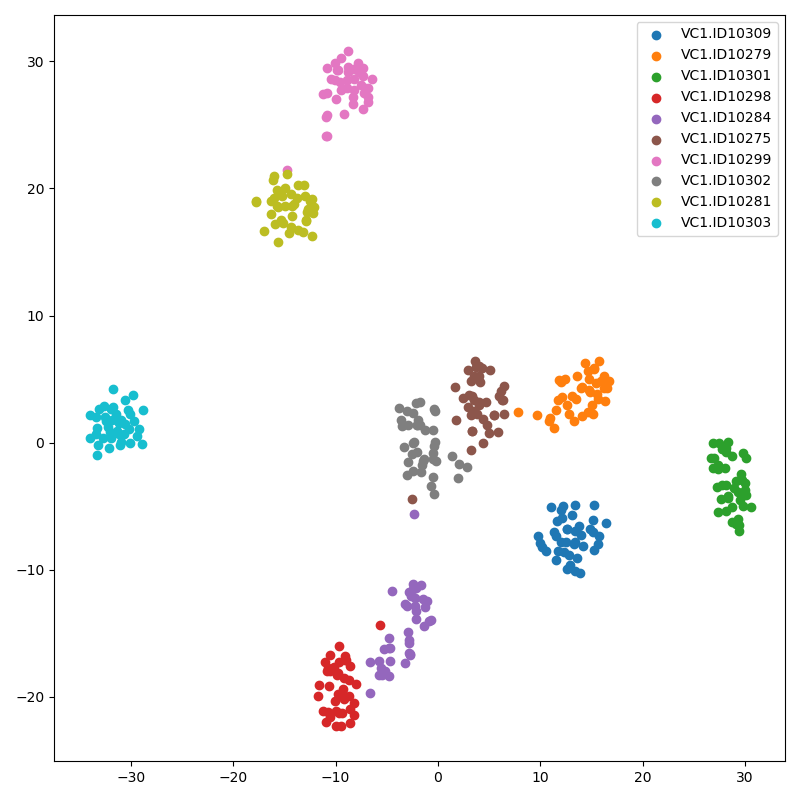
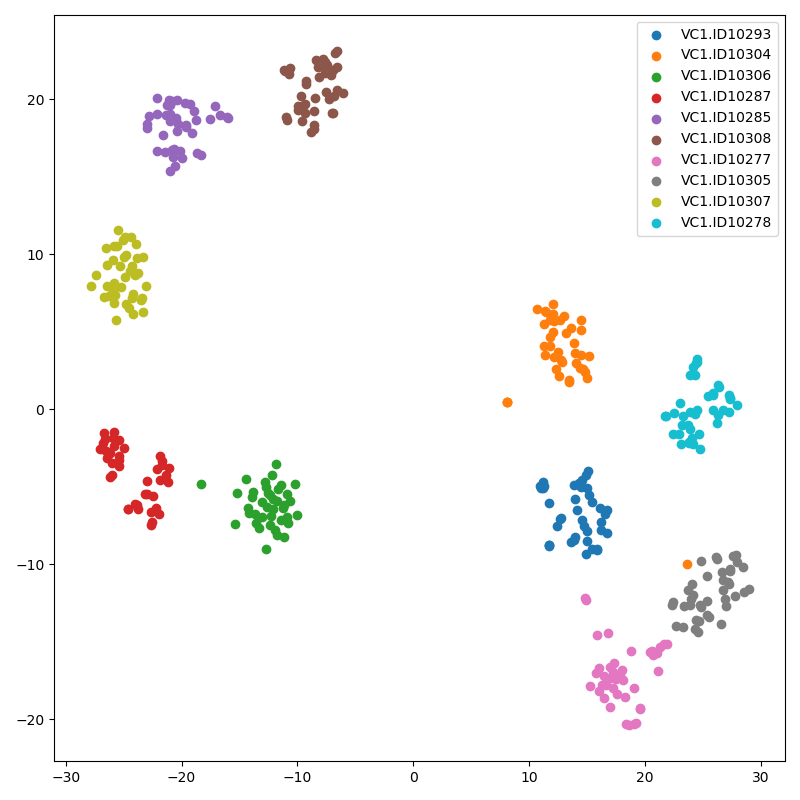

# Speaker embedding based on PyTorch

* This code is used to extract the speaker's feature from wav and make the speaker's embedding.
* This code is referred from [Speaker embedding based on TensorFlow 1.x](https://github.com/CODEJIN/speaker_embedding)
* The algorithm is based on the following papers:

```
Wan, L., Wang, Q., Papir, A., & Moreno, I. L. (2017). Generalized end-to-end loss for speaker verification. arXiv preprint arXiv:1710.10467.
Jia, Y., Zhang, Y., Weiss, R. J., Wang, Q., Shen, J., Ren, F., ... & Wu, Y. (2018). Transfer Learning from Speaker Verification to Multispeaker Text-To-Speech Synthesis. arXiv preprint arXiv:1806.04558.
Qian, K., Zhang, Y., Chang, S., Yang, X., & Hasegawa-Johnson, M. (2019). Zero-shot voice style transfer with only autoencoder loss. arXiv preprint arXiv:1905.05879.
```

# Requirements

* torch >= 1.5.0
* tensorboardX >= 2.0
* librosa >= 0.7.2
* matplotlib >= 3.1.3

* Optional for loss and t-SNE result check
    * tensorboard >= 2.2.2

# Used dataset

* Currently uploaded code is compatible with the following datasets. The O mark to the left of the dataset name is the dataset actually used in the uploaded result. I used all datasets.

|        | | Dataset   | Dataset address                                 |
|--------|-|-----------|-------------------------------------------------|
| O      | | VCTK      | https://datashare.is.ed.ac.uk/handle/10283/2651 |
| O      | | LibriTTS  | https://openslr.org/60/                         |
| O      | | CMU Arctic| http://www.festvox.org/cmu_arctic/index.html    |
| O      | | VoxCeleb1 | http://www.robots.ox.ac.uk/~vgg/data/voxceleb/  |
| O      | | VoxCeleb2 | http://www.robots.ox.ac.uk/~vgg/data/voxceleb/  |

# Hyper parameters
Before proceeding, please set the pattern, inference, and checkpoint paths in 'Hyper_Parameter.yaml' according to your environment.

* Sound
    * Setting basic sound parameters.

* Encoder
    * Setting the parameters of speaker embedding.

* Train
    * Setting the parameters of training.
    * When a speaekr's pattern is small than `Pattern_per_Speaker`, the speaker's all patterns are ignored.

* Checkpoint_Path
    * Setting the checkpoint path

* Log_Path
    * Setting the tensorboard log path

* Device
    * Setting which GPU device is used in multi-GPU enviornment.
    * Or, if using only CPU, please set '-1'.

# Generate pattern

## Command
```
python Pattern_Generate.py [parameters]
```

## Parameters

At least, one or more of datasets must be used.

* -vctk <path>
    * Set the path of VCTK. VCTK's patterns are generated.
* -vc1 <path>
    * Set the path of VoxCeleb1. VoxCeleb1's patterns are generated.
* -vc2 <path>
    * Set the path of VoxCeleb2. VoxCeleb2's patterns are generated.
* -libri <path>
    * Set the path of LibriTTS. LibriTTS's patterns are generated.
* -cmua <path>
    * Set the path of CMU Arctic. CMU Arctic's patterns are generated.
* -vc1t <path>
    * Set the path of VoxCeleb1 testset. VoxCeleb1's patterns are generated for an evaluation.
* -mw
    * The number of threads used to create the pattern

# Run

## Command
```
python Train.py -s <int>
```

* `-s <int>`
    * The resume step parameter.
    * Default is 0.

# Result
* The following results are based on the checkpoint of 100000 steps of 64 speaker (15 patterns per speaker) batchs (148.81 epochs).
* Test speakers are the testset of VoxCeleb1 which is not trained.
* As a result of comparison with the model except VC2 dataset, I concluded that the number of speakers is important for model performance.
* The following two t-SNE result figures are from same trained model.
    * Both are used one utterence mel-spectrogram.
    * Upper is the result of single slice which is based on the random selected frame length from 140 to 180 like training.
    * Lower is the result of multi slices which is based on the 5 x 64 frames length (32 frames are overlapped).
    * Usually, multi slices are stable than single slice.
        
* Single slice

    

* Multi slices

    

# Trained checkpoint

* This is the checkpoint of 100000 steps of 64 speaker (15 patterns per speaker) batchs (148.81 epochs).

* [Checkpoint link](./Example_Results/Checkpoint/S_100000.pkl)
* [Hyperparameter link](./Example_Results/Checkpoint/Hyper_Parameter.yaml)

